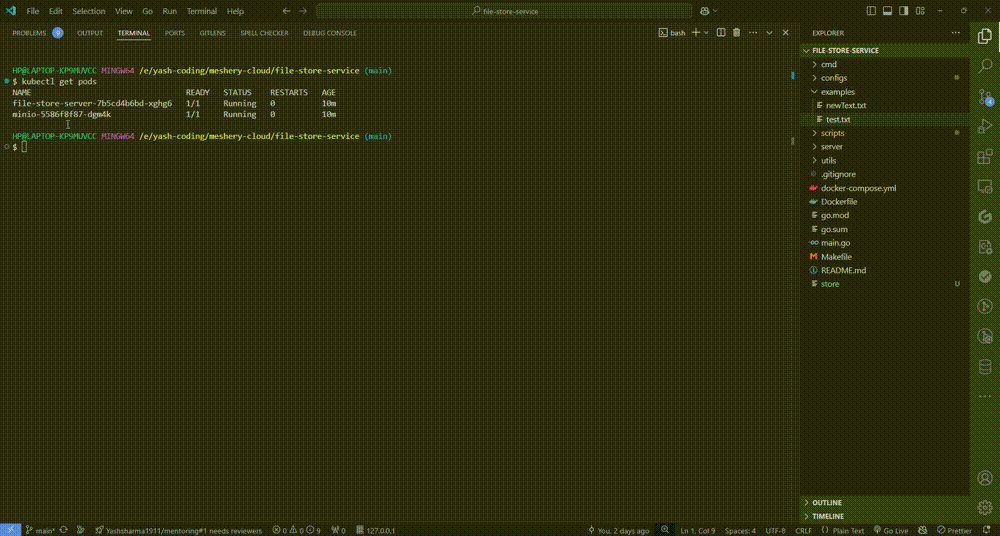

# File Store System CLI

`store` is a command-line tool to manage your files and provide self host environment. This README will guide you through installation, setup, and usage of the tool.

Store uses MinIo bucket (blog storage) to store files. If you will use docker to run service it will store files in your current file store repo path. I've mentioned other types of deployment where we are leveraging the public server provided by MinIO and self host service like kubernetes deployment.
### Example
In this video I used kubernetes to run application however it is optional, checkout Installation part to run application locally quickly
<br>


### Prerequisites

Before you start, ensure that you have the following tools installed on your system:

- [Git](https://git-scm.com/)
- [Go](https://golang.org/dl/)
- [Docker](https://www.docker.com/products/docker-desktop) (Optional, if you're using Docker to run MinIO)

# Installation
## Quick start
You can run CLI application and use public minio server to host file, this is easy to run and test CLI application quickly.

1. Clone the repository to your local machine using the following command:
```bash
git clone https://github.com/Yashsharma1911/file-store-service
cd file-store-service
```
2. After clone get successful, run the below command (Note: `make` command should be installed in your system if it is not then run next command of it)

```bash
make local-server
```

2. **[Alternative]** : If `make` is not installed in your system, copy this and run in your root dir of repo.
```bash
./scripts/setup-local-server.sh
```

**Note:** It is suggested to use default terminal of your system. Incase you're using any customized shell ensure to restart it, if you're using Z shell in Mac run `source ~/.zshrc` to take effect or restart the terminal.
3. **Now open a new terminal** and test CLI by adding a file to server.
```bash
store add [file path]

# If you are in root dir of project you can run the below command also
store add examples/newText.txt

# Use "" in file path if you want to upload two files or if there is space or a special character in your path
store add "examples/newText.txt" "examples/test.txt"
```

Use below command to see list of stored files.
```bash
store ls
```

## Deploy file store in Kubernetes (Optional)

You can deploy file store to your kubernetes cluster, run below make command which will auto deploy kubernetes resources to run your application.

**Note:** After installation gets successful do run `kubectl get pods` to ensure deployments are up and running.

```bash
make kubernetes-deployment
```

**[Alternative]** : if `make` is not installed run below command in root dir of project
```bash
./scripts/setup-kubernetes.sh
```

Use below command to uninstall resources.

```bash
make uninstall-deployment
```

## Deploy file store in Docker (Optional)

Run below command to deploy application constainers, it will start Minio container exposed at `:9000` port and will start server container at `:30000` port.

```bash
make docker-up
```
**[Alternative]** : if `make` is not installed.
```bash
docker compose up
```
#### Additional
Checkout File Store CLI [docker image](https://hub.docker.com/repository/docker/yashsharma1911/file-store/general)

# Suported Commands
`store add [file path] [file2 path]` - Store file to server, if file already exist on server it will return error for that file<br>
`store ls` - List of all stored files<br>
`store update [file path]` - Update existing file content, if file not exist it will create a new file<br>
`store rm [file name]` - Remove file from store.<br>
`store wc` - Get total number of words present in all files. <br>
`store freq-words [--limit|-n 10] [--order=dsc|asc]` - List of least or most frequent words, use `--order` to change order of least or most and use `--limit | -n` flag for the number of words you want to check, default is 10 <br>

# System Achitecture

